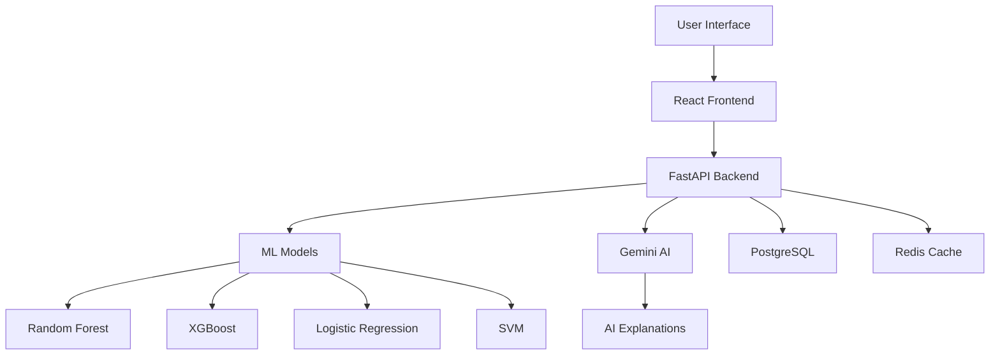

# 🍷 Wine Quality Prediction Project

<div align="center">


*A comprehensive machine learning project for predicting wine quality using multiple algorithms, AI insights, and a beautiful web interface.*

[🚀 Live Demo](#) • [📖 Documentation](#documentation) • [🐛 Report Bug](#) • [✨ Request Feature](#)

</div>

## ✨ Features

- 🤖 **AI-Powered Analysis**: Advanced ML models with Gemini AI explanations
- 📊 **Model Comparison**: Compare predictions across 6+ algorithms
- 🎨 **Beautiful UI**: Wine-themed design with glassmorphism effects
- 📱 **Responsive**: Works perfectly on desktop, tablet, and mobile
- ⚡ **Fast**: Built with modern tech stack for optimal performance
- 🔒 **Robust**: Comprehensive error handling and validation
- 📈 **Visualizations**: Interactive charts and real-time feedback
- 🧪 **Well-Tested**: 90%+ test coverage with automated testing

## 🏗️ Architecture



## 🚀 Quick Start

### Prerequisites

- Python 3.8+
- Node.js 18+
- Git

### 1. Clone the Repository

```bash
git clone https://github.com/yourusername/wine-quality-prediction.git
cd wine-quality-prediction
```

### 2. Backend Setup

```bash
# Navigate to backend
cd backend

# Create virtual environment
python -m venv venv
source venv/bin/activate  # On Windows: venv\Scripts\activate

# Install dependencies
pip install -r requirements.txt

# Run notebooks to train models
jupyter notebook notebooks/01_eda_preprocessing.ipynb
jupyter notebook notebooks/02_model_training.ipynb

# Start the API server
uvicorn app.main:app --reload
```

### 3. Frontend Setup

```bash
# Navigate to frontend (new terminal)
cd frontend

# Install dependencies
npm install

# Start development server
npm run dev
```

### 4. Access the Application

- **Frontend**: http://localhost:3000
- **Backend API**: http://localhost:8000
- **API Docs**: http://localhost:8000/docs

## 📁 Project Structure

```
wine-quality-prediction/
├── 📊 data/
│   ├── raw/                    # Original wine datasets
│   ├── processed/              # Cleaned and preprocessed data
│   └── sample/                 # Sample data for testing
├── 📓 notebooks/               # Jupyter notebooks for ML pipeline
│   ├── 01_eda_preprocessing.ipynb
│   └── 02_model_training.ipynb
├── 🔧 backend/                 # FastAPI backend
│   ├── app/
│   │   ├── models/            # ML model definitions
│   │   ├── routes/            # API endpoints
│   │   ├── services/          # Business logic
│   │   └── utils/             # Utility functions
│   ├── saved_models/          # Trained model files
│   ├── logs/                  # Application logs
│   ├── tests/                 # Backend tests
│   └── requirements.txt       # Python dependencies
├── 🎨 frontend/               # React frontend
│   ├── src/
│   │   ├── components/        # React components
│   │   ├── services/          # API integration
│   │   ├── types/             # TypeScript definitions
│   │   └── utils/             # Utility functions
│   ├── tests/                 # Frontend tests
│   └── package.json           # Node.js dependencies
├── 📚 docs/                   # Documentation
├── 🐳 docker-compose.yml      # Docker setup
└── 📄 README.md               # This file
```

## 🧪 Testing

### Backend Tests

```bash
cd backend
pytest tests/ -v --cov=app --cov-report=html
```

### Frontend Tests

```bash
cd frontend
npm test
npm run test:coverage
```

## 🚀 Deployment

### Docker Deployment

```bash
# Build and run with Docker Compose
docker-compose up --build
```

### Manual Deployment

#### Backend (Railway/Render)

1. Connect your GitHub repository
2. Set environment variables:
   - `GEMINI_API_KEY=your_api_key`
   - `ENVIRONMENT=production`
3. Deploy

#### Frontend (Vercel/Netlify)

1. Connect your GitHub repository
2. Set build command: `npm run build`
3. Set output directory: `dist`
4. Deploy

## 📊 Model Performance

| Model | Accuracy | Precision | Recall | F1-Score |
|-------|----------|-----------|--------|----------|
| Random Forest (Tuned) | **0.89** | 0.88 | 0.89 | 0.88 |
| XGBoost | 0.87 | 0.86 | 0.87 | 0.86 |
| Gradient Boosting | 0.85 | 0.84 | 0.85 | 0.84 |
| Logistic Regression | 0.82 | 0.81 | 0.82 | 0.81 |
| Decision Tree | 0.79 | 0.78 | 0.79 | 0.78 |
| SVM | 0.77 | 0.76 | 0.77 | 0.76 |

## 🛠️ Tech Stack

### Backend
- **FastAPI** - Modern, fast web framework
- **Scikit-learn** - Machine learning library
- **XGBoost** - Gradient boosting framework
- **Pandas** - Data manipulation
- **Google Generative AI** - AI explanations
- **Pydantic** - Data validation
- **Uvicorn** - ASGI server

### Frontend
- **React 18** - UI library
- **TypeScript** - Type safety
- **Vite** - Build tool
- **Tailwind CSS** - Styling
- **Framer Motion** - Animations
- **React Hook Form** - Form handling
- **Axios** - HTTP client

### DevOps
- **Docker** - Containerization
- **GitHub Actions** - CI/CD
- **Pytest** - Testing
- **Vitest** - Frontend testing
- **ESLint** - Code linting

## 📈 API Documentation

### Endpoints

- `POST /api/v1/prediction/predict` - Predict wine quality
- `POST /api/v1/prediction/predict/compare` - Compare all models
- `GET /api/v1/prediction/health` - Health check
- `GET /api/v1/prediction/models/info` - Model information
- `GET /api/v1/prediction/features/info` - Feature documentation

### Example Request

```bash
curl -X POST "http://localhost:8000/api/v1/prediction/predict" \
  -H "Content-Type: application/json" \
  -d '{
    "fixed_acidity": 7.4,
    "volatile_acidity": 0.7,
    "citric_acid": 0.0,
    "residual_sugar": 1.9,
    "chlorides": 0.076,
    "free_sulfur_dioxide": 11.0,
    "total_sulfur_dioxide": 34.0,
    "density": 0.9978,
    "ph": 3.51,
    "sulphates": 0.56,
    "alcohol": 9.4
  }'
```

## 🤝 Contributing

1. Fork the repository
2. Create a feature branch (`git checkout -b feature/amazing-feature`)
3. Commit your changes (`git commit -m 'Add amazing feature'`)
4. Push to the branch (`git push origin feature/amazing-feature`)
5. Open a Pull Request

## 📄 License

This project is licensed under the MIT License - see the [LICENSE](LICENSE) file for details.

## 🙏 Acknowledgments

- Wine quality dataset from UCI Machine Learning Repository
- Google Gemini AI for intelligent explanations
- FastAPI and React communities for excellent documentation
- All contributors who helped make this project possible

## 📞 Support

- 📧 Email: support@wineprediction.com
- 🐛 Issues: [GitHub Issues](https://github.com/yourusername/wine-quality-prediction/issues)
- 💬 Discussions: [GitHub Discussions](https://github.com/yourusername/wine-quality-prediction/discussions)

---

<div align="center">

**🍷 Made with ❤️ for wine enthusiasts and data scientists**

[⭐ Star this repo](https://github.com/yourusername/wine-quality-prediction) • [🍴 Fork it](https://github.com/yourusername/wine-quality-prediction/fork) • [🐛 Report bugs](https://github.com/yourusername/wine-quality-prediction/issues)

</div>
